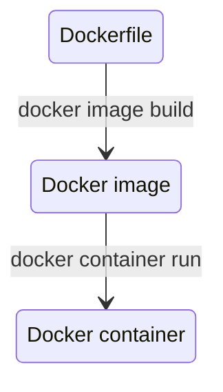

# 1. Dockerの基礎
# 2. Dockerコンテナのデプロイ


```shell
# DockerfileからDockerイメージをビルドする
docker image build
```
```shell
# Dockerイメージを指定してDockerコンテナを作成/実行する
docker container run
```
```shell
# Docker Hub からイメージを検索する
docker search
```
```shell
# DockerレジストリからDockerイメージをダウンロードする
docker image pull
```
```shell
# Dockerホストに保持されているイメージの一覧を表示する
docker image ls
```
```shell
# Dockerイメージの特定のバージョンにタグをつける
docker image tag
```
```shell
# DockerイメージをDocker Hubなどのレジストリに登録する
docker image push
```
```shell
# コンテナの一覧を表示する
docker container ls
```
```shell
# 実行しているコンテナを終了する
docker container stop
```
```shell
# コンテナを再起動する
docker container restart
```
```shell
# コンテナをディスクから完全に破棄する
docker container rm
```
```shell
# 実行している特定のDockerコンテナの標準出力を表示する
docker container logs
```
```shell
# 実行中のコンテナの中で任意のコマンドを実行する
docker container exec
```
```shell
# コンテナ間、コンテナ・ホスト間でファイルをコピーする
docker container cp
```
```shell
# 実行していないコンテナを一括で削除する
docker container prune
```
```shell
# 不要なイメージを削除する
docker image prune
```
```shell
# 利用されていない全てのDockerリソースを一括で削除する
docker system prune
```
```shell
# コンテナ単位でのシステムリソースの利用状況を知る
docker container stats
```
# 3. 実用的なコンテナの構築とデプロイ
# 4. Swarmによる実践的なアプリケーション構築
# 5. Kubernetes入門
# 6. Kubernetesのデプロイ・クラスタ構築
# 7. Kubernetesの発展的な利用
# 8. コンテナの運用
# 9. より軽量なDockerイメージを作る
# 10. Dockerの様々な活用方法

